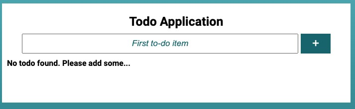
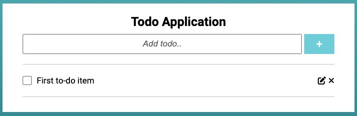

# React.js Todo App
This is a simple todo app built with React.js. It allows you to add, edit, and delete tasks.

## Installation
- Clone the repository and navigate to the project directory. 
- Run `npm install` to install the project dependencies. 
- Run `npm start` to start the development server. 
- Open [http://localhost:3000](http://localhost:3000) to view the app in your browser. 
- You can now add, edit, and delete tasks.

## Features
- Add tasks
- Edit tasks
- Delete tasks
- All tasks are stored in local storage and persist even after the page is refreshed.
- Notifications are displayed when a task is added, edited, or deleted.

## Technologies
- React.js
- JavaScript
- HTML
- CSS

## Screenshots

 
